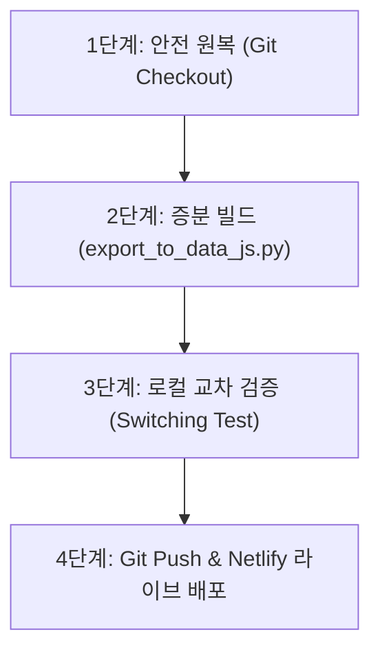

# 📋 [SOP] 월간 수수료 대시보드 증분 병합 및 안전 배포 표준 운영 가이드라인

본 문서는 매월 27일 진행되는 수수료 정산 데이터의 전처리 완료 후, 기존 깃허브 및 Netlify에 누적되어 있는 역사적 데이터를 완벽하게 보존하면서 신규 월의 데이터를 안전하게 통합(Merge)하고 원격 배포하기 위한 표준 운영 절차(Standard Operating Procedure)입니다.

---

## 🚨 [골든 룰] 데이터 유실 방지 3대 수칙

> [!CAUTION]
> **1. 정산 전 로컬 data.js의 GitCheckout 선행 (필수)**
> * `data.js` 내보내기 스크립트는 로컬의 `data.js` 파일이 온전한 최신 원격본(HEAD) 상태라고 신뢰하고 병합을 수행합니다. 
> * 이전 작업으로 인해 로컬 파일이 오염되어 있을 수 있으므로, 반드시 **원격 원본으로 되돌려 놓는 명령어**를 선행 실행해야 합니다.
>
> **2. 덮어쓰기(Overwrite)가 아닌 증분식(Incremental) 업데이트 확인**
> * 스크립트 수정으로 현재 `export_to_data_js.py`는 기존 데이터를 파싱하여 병합하는 구조입니다. 이 파일의 구조가 훼손되지 않도록 관리해야 합니다.
>
> **3. 배포 전 다중 월 교차 클릭 검증**
> * 신규 월뿐만 아니라, **이전 월(예: 4월 등)**로 버튼을 전환했을 때 화면의 수치들이 깨지거나 `0원`으로 초기화되지 않는지 필히 눈으로 크로스 체크해야 합니다.

---

## 📐 [표준 스키마] 마스터 엑셀 컬럼 규격 및 정렬 규칙

매월 수수료 전처리 파이프라인에서 생성되는 최종 마스터 엑셀 파일(`master_commission_YYMM_optimized.xlsx`)은 기존 데이터와의 정합성을 위해 다음의 **A~Y(0~23) 표준 24개 컬럼 순서**와 **시트별 분기 스키마(총 29개 컬럼)**를 강제 적용해야 합니다.

### 1. A~Y (0~23) 표준 24개 컬럼 정렬
원본 보험사 정산 시트로부터 추출하는 24개 필드의 정렬 순서는 다음과 같아야 합니다.
```text
0: NO
1: 정산년월
2: 제휴사명
3: 증권번호
4: 본사
5: 사업단
6: 지사
7: 지점
8: 팀
9: 사번
10: FC명
11: 지급구분
12: 기초상태  *(주의: 원본 파일의 12번 '표준상태' 값이 이 컬럼에 매핑됨)*
13: 표준상태  *(주의: 원본 파일의 13번 '기초상태' 값이 이 컬럼에 매핑됨)*
14: 상품군
15: 상품코드
16: 상품명
17: 계약일자
18: 태아구분
19: 계약자
20: 납입방법
21: 납입기간  *(V열)*
22: 납입회차  *(W열)*
23: 보험료    *(X열)*
```
> [!WARNING]
> * `merge_commission_data.py`의 `STANDARD_24_COLS` 리스트 선언 시 **납입방법 ➡️ 납입기간 ➡️ 납입회차 ➡️ 보험료** 순서를 절대 변경하면 안 됩니다.
> * 순서가 뒤틀리면 원본의 '납입기간'이나 '납입회차' 데이터가 '보험료' 컬럼으로 오인 적재되어 대시보드 및 회계 보고서 전체의 산출 오류를 유발합니다.

### 2. 시트별 분기 스키마 (총 29개 컬럼 강제)
시트별로 사용되는 전용 실적 컬럼을 분리하고 불필요한 필드는 제거하여 컬럼 개수를 정확히 **29개**로 싱크해야 합니다.

* **생명보험 (`Life` 시트)**:
  `STANDARD_24_COLS` (24개) + `['환산', '최종수수료', 'FC수수료', '지사수수료', '분담금']`
  *(생보는 '수정보험료' 컬럼을 생성하지 않음)*
* **손해보험 (`NonLife` 시트)**:
  `STANDARD_24_COLS` (24개) + `['수정보험료', '최종수수료', 'FC수수료', '지사수수료', '분담금']`
  *(손보는 '환산' 컬럼을 생성하지 않음)*

---

## 🛠️ [4단계] 표준 배포 프로세스



### 1단계: 🛡️ 데이터 안전 원복
신규 정산 데이터를 덧붙이기 전, 로컬 저장소의 `data.js`를 깃허브 최신본 상태로 원복합니다.
```powershell
# 작업 공간 루트 디렉토리에서 실행
git checkout data.js
```

---

### 2단계: ⚙️ 증분 빌드 및 병합 실행
마스터 엑셀 파일(`data/master_commission_YYMM_optimized.xlsx`)이 준비되었는지 확인한 뒤, 내보내기 스크립트를 기동합니다.
```powershell
# YYMM 형식으로 대상을 지정하여 실행 (예: 26년 5월 -> 2605)
python scripts/export_to_data_js.py 2605
```
* **정상 실행 로그 예시:**
  ```text
  Loaded existing months from data.js: Fee=['2026_04'], Promo=['2026_05', '2026_01', '2026_02', '2026_03', '2026_04']
  Successfully merged & exported 11786 rows to data.js for key 2026_05
  ```
  *(로그에 기존 달인 `Fee=['2026_04']`가 완벽하게 로드되었다고 나와야 안전하게 병합된 것입니다.)*

---

### 3단계: 🧪 로컬 교차 검증 및 기본 조회 월 패치
대시보드를 로드할 때 신규 월이 기본으로 뜨도록 `index.html` 소스 코드를 패치하고 로컬 검증합니다.

#### ① `index.html` 기본 월 업데이트 (소프트 패치)
```javascript
// index.html 내 initDashboard() 수정
currentData = rawData.fee_data["2026_05"] || [];

// index.html 내 window.load 이벤트리스너 수정 (5월 클릭하게 변경)
setTimeout(() => {
    const targetBtn = Array.from(document.querySelectorAll('.month-btn')).find(b => b.innerText.includes('5월'));
    if(targetBtn) {
        changePeriod(2026, 5, '수수료', targetBtn);
    }
}, 500);
```

#### ② 로컬 서버 구동 및 다중 월 스위칭 검증
```powershell
# 로컬 개발 서버 기동
python -m http.server 8000
```
1. `http://localhost:8000/index.html` 접속 후 패스코드 `1057` 입력 입장.
2. 5월 데이터 수치(총 수수료 `55,460,043`원 등) 확인.
3. **'4월'** 버튼을 클릭하여 화면 상단이 4월 정밀분석으로 정상 스위칭 및 수치(`94,923,080`원 등)가 제대로 출력되는지 확인.
4. 검증 완료 후 포트 정리를 위해 파이썬 서버 중단 (`Ctrl + C` 또는 백그라운드 프로세스 종료).

---

### 4단계: 🚀 깃허브 푸시 및 Netlify 배포
검증을 끝마친 자산들을 깃허브에 커밋하고 푸시합니다.
```powershell
# 1. 대상 파일 스테이징
git add data.js index.html scripts/export_to_data_js.py

# 2. 구조화된 의미론적 커밋 메시지 작성
git commit -m "feat(dashboard): merge 2605 commission data and preserve historical records"

# 3. 원격 리포지토리 푸시
git push origin main
```
* **실시간 운영 서버 확인:**
  * 푸시 후 약 1~2분 대기하면 Netlify 배포 빌드가 완료됩니다.
  * 실 배포 도메인인 **[https://wealthfee.netlify.app](https://wealthfee.netlify.app)**에 직접 원격 접속하여, 다중 월 데이터가 정상 스위칭되는지 최종적으로 눈으로 최종 정합성을 입증(DOD)합니다.

---

## 📝 유지보수 가이드 (Troubleshooting)

### Q1. 로컬에서 데이터가 합쳐지지 않고 한 달 치만 나와요.
* **원인:** 1단계인 `git checkout data.js`를 거치지 않고, 덮어쓰인 버전 상태 위에 그대로 스크립트를 재실행했기 때문입니다.
* **해결책:** `git checkout data.js` 명령어로 원본 복구 후, 다시 2단계부터 차근차근 실행하십시오.

### Q2. 수정을 했는데 4월 버튼이나 5월 버튼이 보이지 않아요.
* **원인:** 브라우저에 구버전 `data.js` 파일이 강력하게 캐싱되어 있어 새로운 데이터를 읽어오지 못하는 것입니다.
* **해결책:** 브라우저에서 `Ctrl + Shift + R` (강력 새로고침)을 실행하여 캐시를 비우고 다시 확인하십시오.

---
*가이드 작성 및 승인: Antigravity AI Full-Stack Lead*
